[Versión en Español](README_ES.md)
# HydroTurbine-SCADA Platform

## Industrial Monitoring and Control Platform for Pelton and Francis Turbines

Integrated industrial automation, SCADA and data acquisition platform for hydraulic turbine laboratories using Siemens PLCs, industrial communications and modern visualization technologies.

---

# Project Overview

This repository contains the conceptual architecture, engineering documentation, instrumentation diagrams, SCADA design and software development associated with the modernization and digitalization of Pelton and Francis hydraulic turbine laboratory systems.

The project focuses on:

* Industrial automation
* SCADA/HMI systems
* Industrial communications
* PLC Siemens S7-1200 integration
* Real-time monitoring
* Historical data acquisition
* Dashboard visualization
* Industrial networking
* IIoT and Industry 4.0 concepts

---

# General Architecture

The following diagram summarizes the conceptual architecture of the integrated HydroTurbine-SCADA platform.

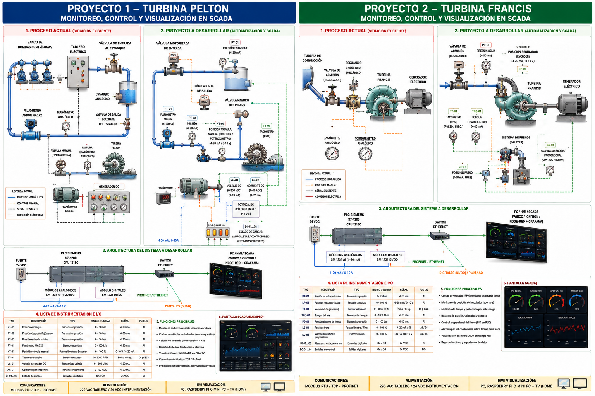

---

# Main Technologies

## Industrial Automation

* Siemens S7-1200 PLC
* TIA Portal
* Industrial Ethernet
* Profinet
* Modbus TCP/IP
* OPC-UA

## SCADA / Visualization

* Node-RED
* Grafana
* WinCC
* Ignition SCADA
* Web dashboards

## Software and Analytics

* Python
* PostgreSQL
* MQTT
* Industrial historians
* Data analytics
* Real-time monitoring

---

# Pelton Turbine System

The Pelton turbine module includes:

* Industrial instrumentation
* Electrical panel design
* PLC I/O mapping
* SCADA architecture
* Hydraulic process monitoring
* Power and electrical measurements
* Historical data acquisition

## Pelton P&ID and Process Architecture

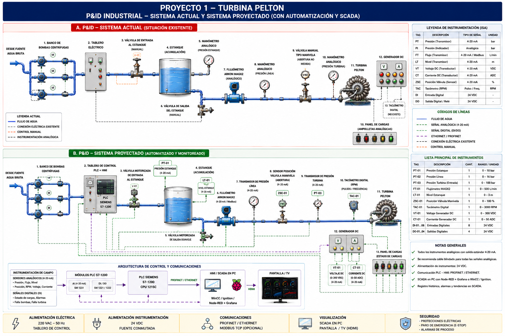

## Pelton SCADA Network Architecture

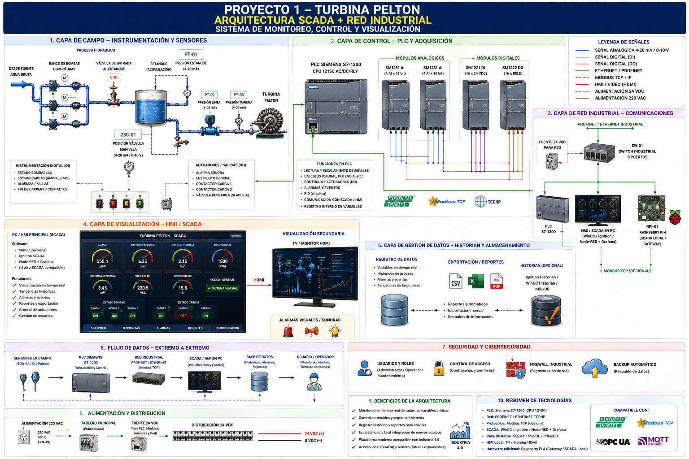

## Pelton PLC I/O Mapping

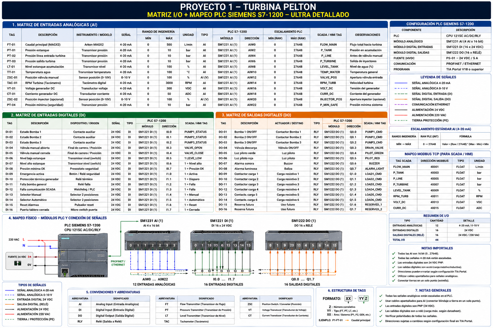

## Pelton Electrical Panel Design

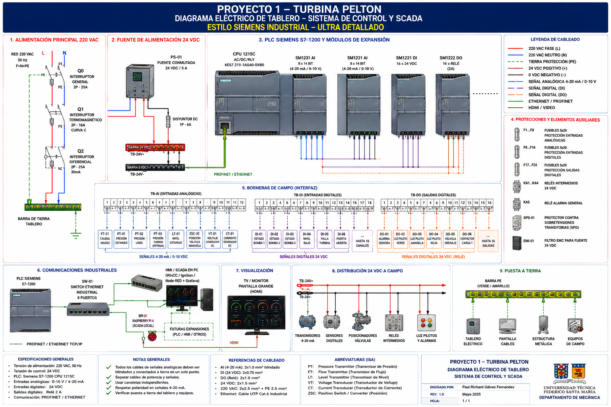

---

# Francis Turbine System

The Francis turbine module incorporates:

* Torque monitoring
* RPM monitoring
* Hydraulic brake control
* PID control strategies
* Industrial SCADA integration
* Industrial communication networks
* Supervisory monitoring systems

## Francis SCADA Overview

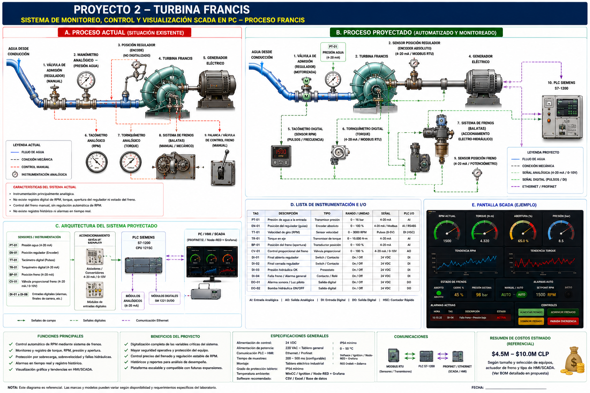

## Francis Process and Instrumentation Diagram

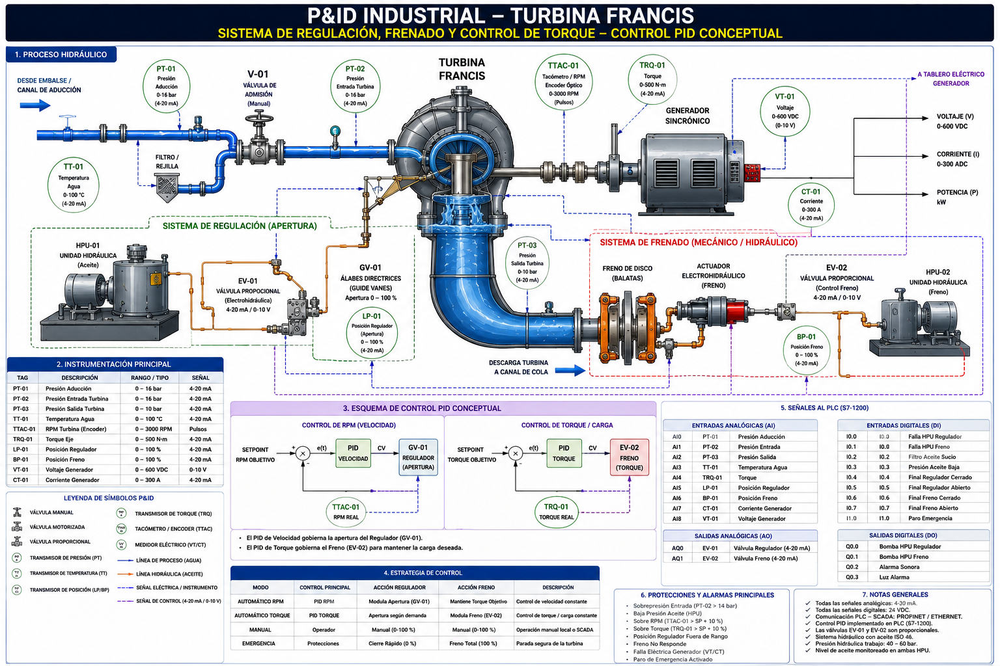

## Francis Mechanical and Control System

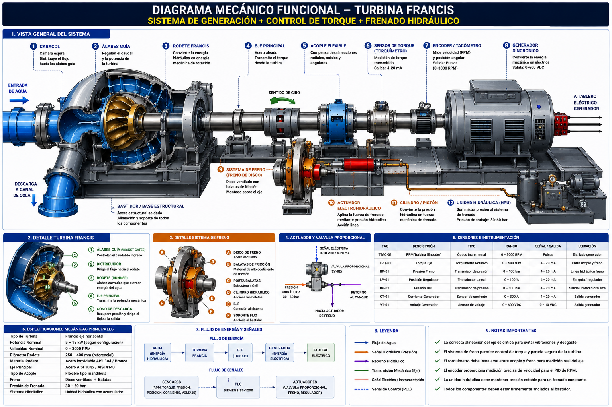

## Francis PID Control Strategy

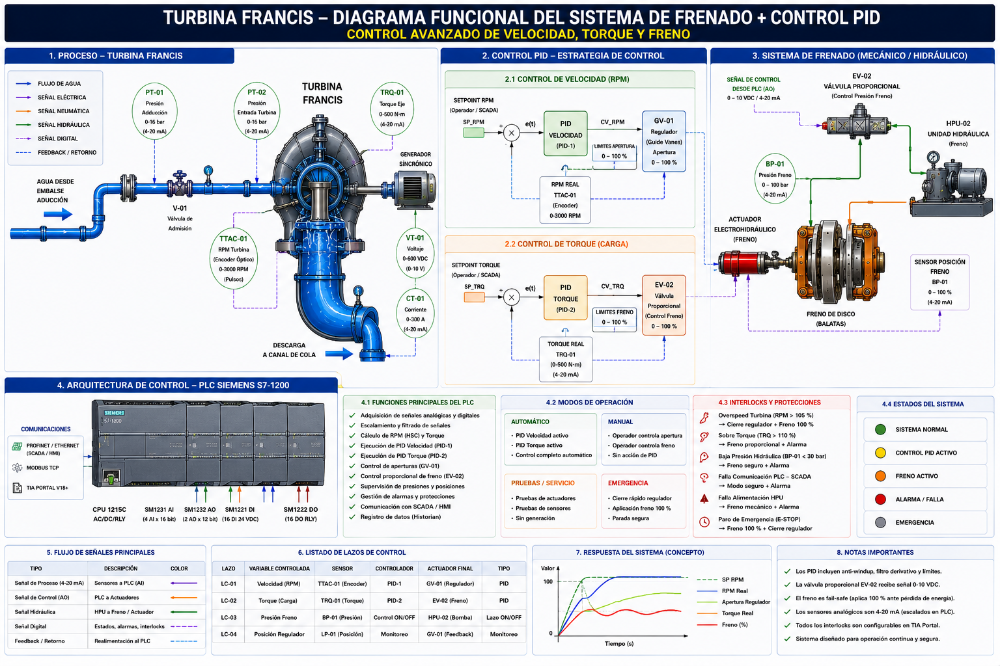

## Francis Industrial SCADA Architecture

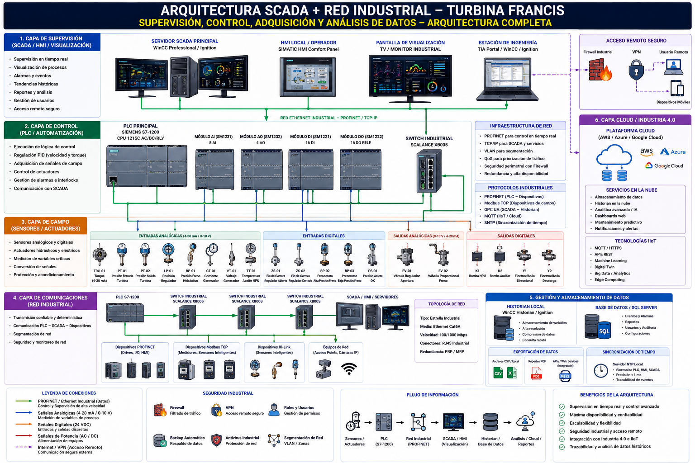

## Francis Electrical Panel

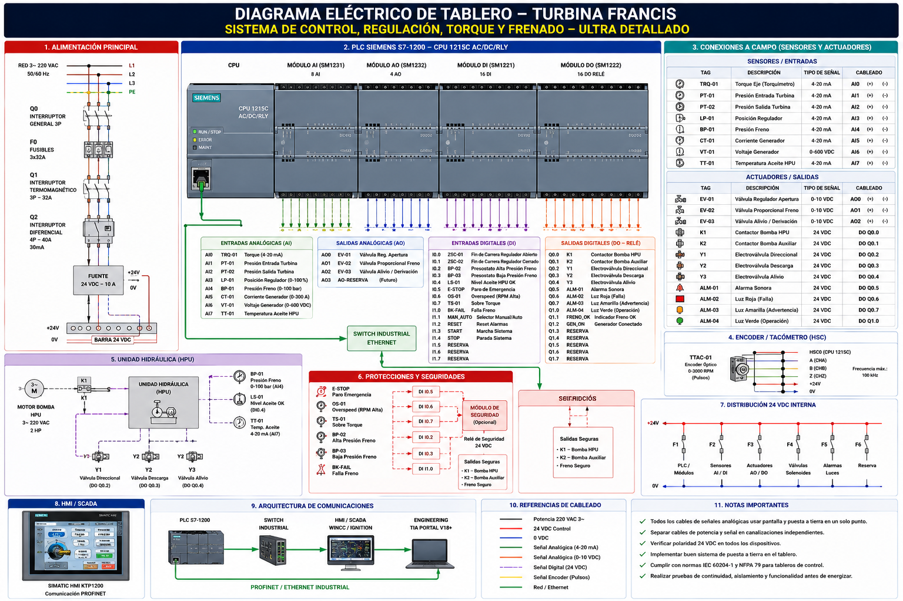

---

# Dashboard and HMI Concepts

The project also considers the development of industrial dashboards and monitoring interfaces for operational visualization and laboratory supervision.

## Pelton Dashboard Concept

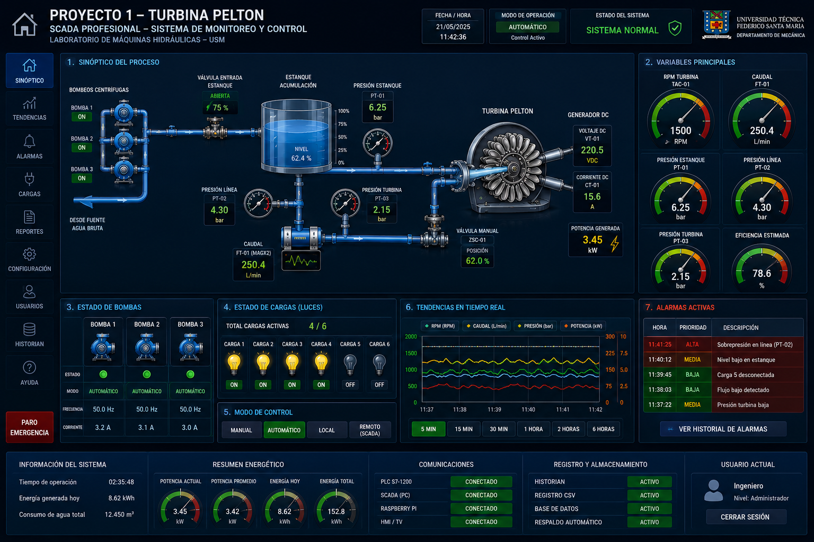

## Francis Dashboard Concept

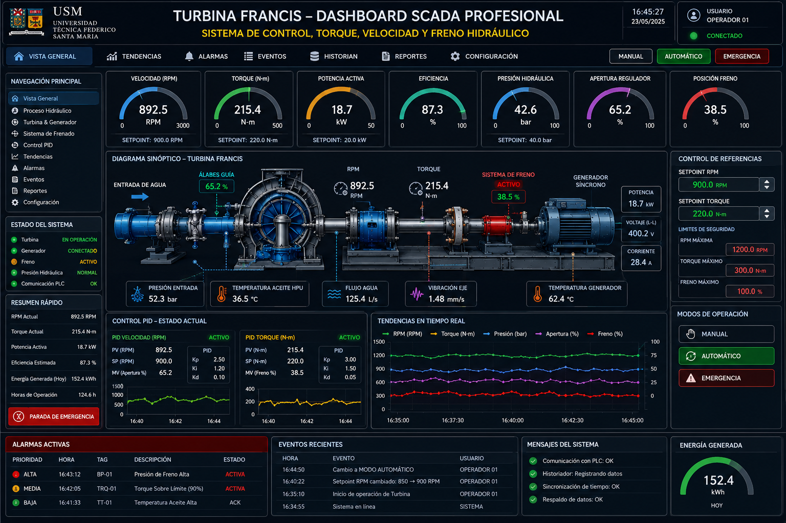

## Turbine Interlocks and Safety Concepts

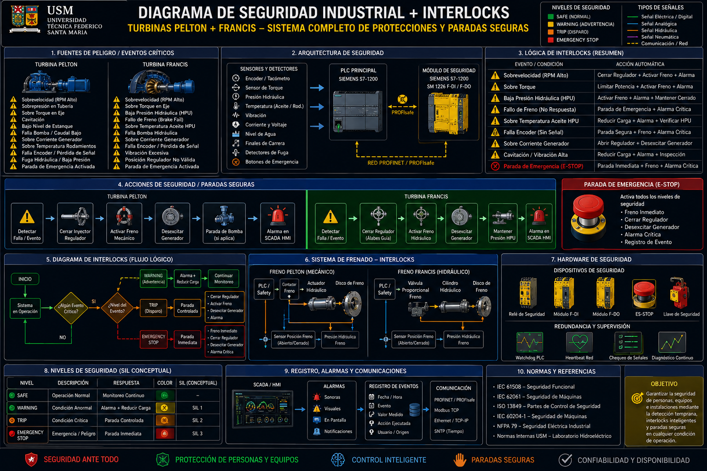

---

# Current Development Stage

Current project status:

* Repository structure initialized
* Engineering documentation uploaded
* Industrial diagrams organized
* Initial Python simulator implemented
* SCADA architecture defined
* PLC communication strategy under development
* Future Siemens integration planned

---

# Python Simulation Environment

An initial simulation environment has been implemented in Python to generate operational variables for:

* RPM
* Flow
* Pressure
* Torque

This stage allows:

* SCADA testing
* Dashboard development
* Communication validation
* Historian integration
* Architecture verification

without requiring physical instrumentation during the initial development stage.

---

# Future Development Roadmap

## Phase 1

* Repository organization
* Engineering documentation
* SCADA conceptual architecture
* Initial simulators

## Phase 2

* PLC Siemens communication
* Snap7 integration
* Modbus TCP/IP testing
* OPC-UA validation

## Phase 3

* Node-RED integration
* Grafana dashboards
* Historian implementation
* Alarm systems

## Phase 4

* Real instrumentation integration
* Field acquisition systems
* Industrial networking
* PID control implementation

## Phase 5

* Advanced analytics
* Predictive monitoring
* Industrial AI concepts
* Industry 4.0 integration

---

# Repository Structure

```text
HydroTurbine-SCADA/
│
├── docs/
├── images/
├── plc/
├── python/
├── scada/
├── simulators/
├── dashboards/
├── data/
├── README.md
└── requirements.txt
```

---

# Author

Paul Richard Gálvez Fernández

Department of Electronics – Academic Support Services
Universidad Técnica Federico Santa María

---

# Project Scope

This project is intended as an industrial-academic platform for:

* Hydraulic turbine monitoring
* Industrial automation education
* SCADA experimentation
* Industrial communications
* Process digitalization
* Applied Industry 4.0 concepts

---

# License

Project currently under development.
