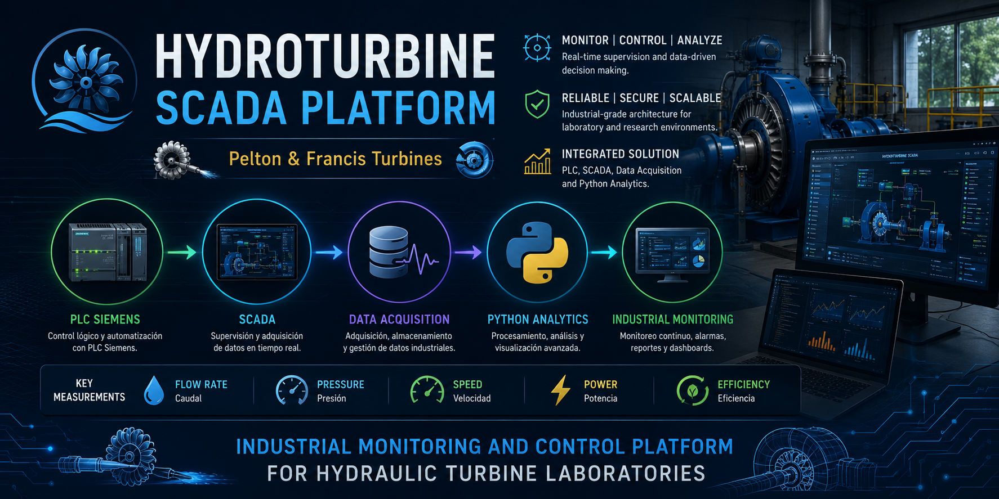

🇬🇧 [English Version](README.md)



<br>

# HydroTurbine-SCADA Platform

## Plataforma Industrial de Monitoreo y Control para Turbinas Pelton y Francis

Plataforma integrada de automatización industrial, SCADA y adquisición de datos para laboratorios de turbinas hidráulicas utilizando PLC Siemens, comunicaciones industriales y tecnologías modernas de visualización.

---

# Descripción General del Proyecto

Este repositorio contiene la arquitectura conceptual, documentación de ingeniería, diagramas de instrumentación, diseño SCADA y desarrollo de software asociados a la modernización y digitalización de sistemas de laboratorio de turbinas hidráulicas Pelton y Francis.

El proyecto está enfocado en:

* Automatización industrial
* Sistemas SCADA/HMI
* Comunicaciones industriales
* Integración con PLC Siemens S7-1200
* Monitoreo en tiempo real
* Adquisición histórica de datos
* Visualización mediante dashboards
* Redes industriales
* Conceptos IIoT e Industria 4.0

---

# Arquitectura General

El siguiente diagrama resume la arquitectura conceptual integrada de la plataforma HydroTurbine-SCADA.


---

# Tecnologías Principales

## Automatización Industrial

* PLC Siemens S7-1200
* TIA Portal
* Ethernet Industrial
* Profinet
* Modbus TCP/IP
* OPC-UA

## SCADA / Visualización

* Node-RED
* Grafana
* WinCC
* Ignition SCADA
* Dashboards Web

## Software y Analítica

* Python
* PostgreSQL
* MQTT
* Historiadores industriales
* Analítica de datos
* Monitoreo en tiempo real

---

# Sistema de Turbina Pelton

El módulo Pelton incorpora:

* Instrumentación industrial
* Diseño de tablero eléctrico
* Mapeo de entradas/salidas PLC
* Arquitectura SCADA
* Monitoreo hidráulico del proceso
* Medición de variables eléctricas
* Adquisición histórica de datos

## P&ID y Arquitectura del Proceso Pelton


## Arquitectura SCADA Pelton


## Mapeo PLC Pelton


## Diseño Eléctrico Pelton


---

# Sistema de Turbina Francis

El módulo Francis incorpora:

* Monitoreo de torque
* Monitoreo de RPM
* Control hidráulico de freno
* Estrategias PID
* Integración SCADA industrial
* Redes industriales
* Sistemas de supervisión y adquisición

## Vista General SCADA Francis


## P&ID Francis


## Sistema Mecánico y de Control Francis


## Estrategia PID Francis


## Arquitectura Industrial SCADA Francis


## Tablero Eléctrico Francis


---

# Dashboards y Conceptos HMI

El proyecto considera además el desarrollo de dashboards industriales e interfaces HMI para visualización operacional y supervisión de laboratorio.

## Dashboard Pelton


## Dashboard Francis


## Seguridad e Interlocks


---

# Estado Actual del Desarrollo

Estado actual del proyecto:

* Estructura inicial del repositorio implementada
* Documentación de ingeniería incorporada
* Diagramas industriales organizados
* Simulador inicial en Python desarrollado
* Arquitectura SCADA definida
* Estrategia de comunicación PLC en desarrollo
* Integración futura con Siemens planificada

---

# Entorno de Simulación Python

Se implementó un entorno inicial de simulación en Python para generar variables operacionales asociadas a:

* RPM
* Caudal
* Presión
* Torque

Esta etapa permite:

* pruebas SCADA
* desarrollo de dashboards
* validación de comunicaciones
* integración con historiadores
* verificación de arquitectura

sin requerir instrumentación física durante las etapas iniciales de desarrollo.

---

# Roadmap de Desarrollo

## Fase 1

* Organización del repositorio
* Documentación de ingeniería
* Arquitectura conceptual SCADA
* Simuladores iniciales

## Fase 2

* Comunicación PLC Siemens
* Integración Snap7
* Validación Modbus TCP/IP
* Integración OPC-UA

## Fase 3

* Integración Node-RED
* Dashboards Grafana
* Historiadores industriales
* Sistemas de alarmas

## Fase 4

* Integración instrumentación real
* Sistemas de adquisición de campo
* Redes industriales
* Implementación PID

## Fase 5

* Analítica avanzada
* Monitoreo predictivo
* Conceptos IA industrial
* Integración Industria 4.0

---

# Estructura del Repositorio

```text
HydroTurbine-SCADA/
│
├── docs/
├── images/
├── plc/
├── python/
├── scada/
├── simulators/
├── dashboards/
├── data/
├── README.md
└── requirements.txt
```

---

# Autor

Paul Richard Gálvez Fernández

Departamento de Electrónica – Servicios de Apoyo Académico
Universidad Técnica Federico Santa María

---

# Alcance del Proyecto

Este proyecto está orientado como plataforma industrial-académica para:

* Monitoreo de turbinas hidráulicas
* Educación en automatización industrial
* Experimentación SCADA
* Comunicaciones industriales
* Digitalización de procesos
* Aplicaciones Industria 4.0

---

# Licencia

Proyecto actualmente en desarrollo.
